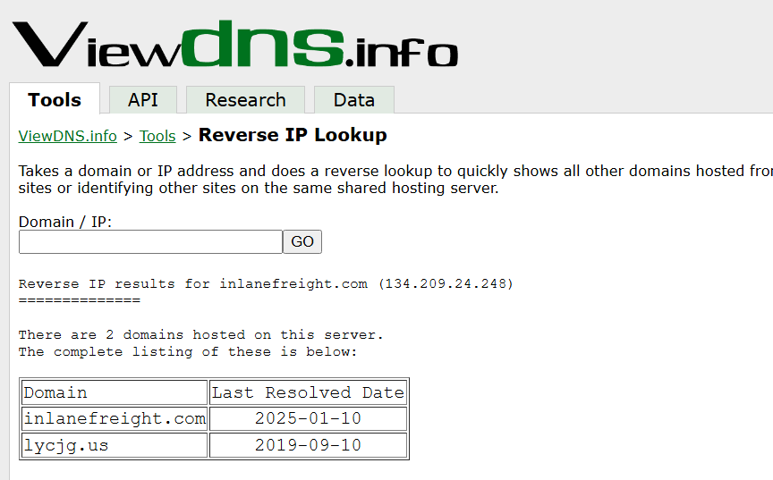
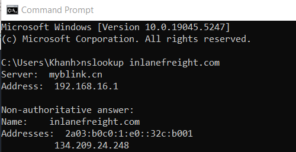

1. Liệt kê thông tin tên miền inlanefreight.com sử dụng BGP-Toolkit hosted by Hurricane Electric ta thu được flag ở trong bản ghi txt 

Flag HTB{5Fz6UPNUFFzqjdg0AzXyxCjMZ}
2. Sử dụng viewdns.info để lấy các bản ghi và dữ liệu của miền xác thực địa chỉ ip của mục tiêu

3. Sử dụng nslookup tìm thông tin tên miền inlanefreight.com

