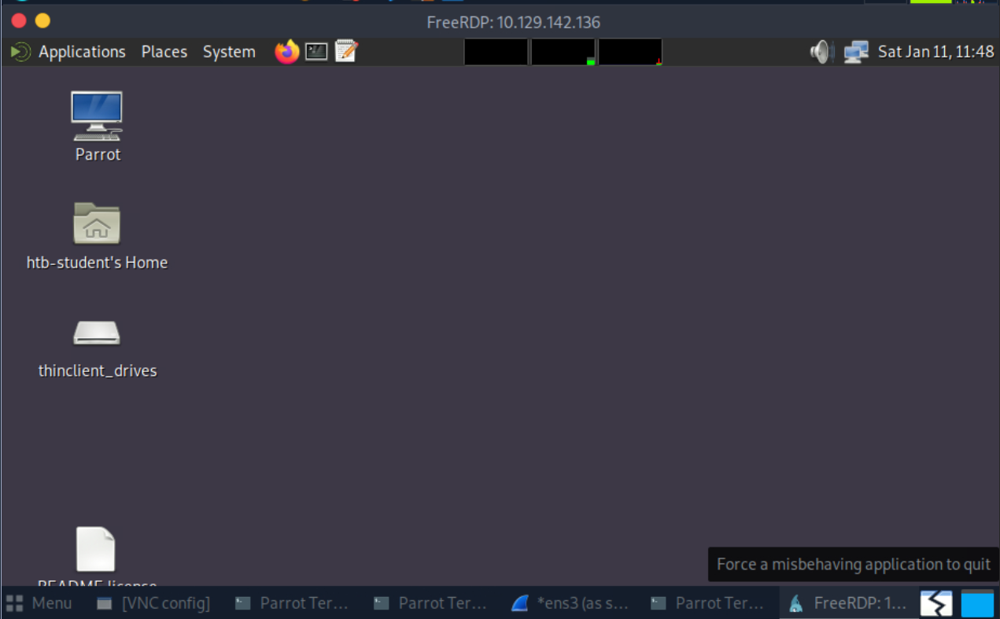
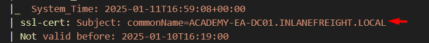

1. From your scans, what is the "commonName" of host 172.16.5.5 ?
```bash
xfreerdp /u:htb-student /p:HTB_@cademy_stdnt! /v:<host_attack>

```bash
┌─[✗]─[htb-student@ea-attack01]─[~]
└──╼ $sudo nmap -sC -sV 172.16.5.5
Starting Nmap 7.92 ( https://nmap.org ) at 2025-01-11 11:58 EST
Nmap scan report for inlanefreight.local (172.16.5.5)
Host is up (0.012s latency).
Not shown: 988 closed tcp ports (reset)
PORT     STATE SERVICE       VERSION
53/tcp   open  domain        Simple DNS Plus
88/tcp   open  kerberos-sec  Microsoft Windows Kerberos (server time: 2025-01-11 16:58:30Z)
135/tcp  open  msrpc         Microsoft Windows RPC
139/tcp  open  netbios-ssn   Microsoft Windows netbios-ssn
389/tcp  open  ldap          Microsoft Windows Active Directory LDAP (Domain: INLANEFREIGHT.LOCAL0., Site: Default-First-Site-Name)
|_ssl-date: 2025-01-11T16:59:19+00:00; 0s from scanner time.
| ssl-cert: Subject: 
| Subject Alternative Name: DNS:ACADEMY-EA-DC01.INLANEFREIGHT.LOCAL, DNS:INLANEFREIGHT.LOCAL, DNS:INLANEFREIGHT
| Not valid before: 2023-10-27T13:11:32
|_Not valid after:  2024-10-26T13:11:32
445/tcp  open  microsoft-ds?
464/tcp  open  kpasswd5?
593/tcp  open  ncacn_http    Microsoft Windows RPC over HTTP 1.0
636/tcp  open  ssl/ldap      Microsoft Windows Active Directory LDAP (Domain: INLANEFREIGHT.LOCAL0., Site: Default-First-Site-Name)
| ssl-cert: Subject: 
| Subject Alternative Name: DNS:ACADEMY-EA-DC01.INLANEFREIGHT.LOCAL, DNS:INLANEFREIGHT.LOCAL, DNS:INLANEFREIGHT
| Not valid before: 2023-10-27T13:11:32
|_Not valid after:  2024-10-26T13:11:32
|_ssl-date: 2025-01-11T16:59:19+00:00; 0s from scanner time.
3268/tcp open  ldap          Microsoft Windows Active Directory LDAP (Domain: INLANEFREIGHT.LOCAL0., Site: Default-First-Site-Name)
|_ssl-date: 2025-01-11T16:59:19+00:00; 0s from scanner time.
| ssl-cert: Subject: 
| Subject Alternative Name: DNS:ACADEMY-EA-DC01.INLANEFREIGHT.LOCAL, DNS:INLANEFREIGHT.LOCAL, DNS:INLANEFREIGHT
| Not valid before: 2023-10-27T13:11:32
|_Not valid after:  2024-10-26T13:11:32
3269/tcp open  ssl/ldap      Microsoft Windows Active Directory LDAP (Domain: INLANEFREIGHT.LOCAL0., Site: Default-First-Site-Name)
| ssl-cert: Subject: 
| Subject Alternative Name: DNS:ACADEMY-EA-DC01.INLANEFREIGHT.LOCAL, DNS:INLANEFREIGHT.LOCAL, DNS:INLANEFREIGHT
| Not valid before: 2023-10-27T13:11:32
|_Not valid after:  2024-10-26T13:11:32
|_ssl-date: 2025-01-11T16:59:19+00:00; 0s from scanner time.
3389/tcp open  ms-wbt-server Microsoft Terminal Services
| rdp-ntlm-info: 
|   Target_Name: INLANEFREIGHT
|   NetBIOS_Domain_Name: INLANEFREIGHT
|   NetBIOS_Computer_Name: ACADEMY-EA-DC01
|   DNS_Domain_Name: INLANEFREIGHT.LOCAL
|   DNS_Computer_Name: ACADEMY-EA-DC01.INLANEFREIGHT.LOCAL
|   DNS_Tree_Name: INLANEFREIGHT.LOCAL
|   Product_Version: 10.0.17763
|_  System_Time: 2025-01-11T16:59:08+00:00
| ssl-cert: Subject: commonName=ACADEMY-EA-DC01.INLANEFREIGHT.LOCAL
| Not valid before: 2025-01-10T16:19:00
|_Not valid after:  2025-07-12T16:19:00
|_ssl-date: 2025-01-11T16:59:19+00:00; 0s from scanner time.
MAC Address: 00:50:56:94:D5:E1 (VMware)
Service Info: Host: ACADEMY-EA-DC01; OS: Windows; CPE: cpe:/o:microsoft:windows

Host script results:
|_nbstat: NetBIOS name: ACADEMY-EA-DC01, NetBIOS user: <unknown>, NetBIOS MAC: 00:50:56:94:d5:e1 (VMware)
| smb2-security-mode: 
|   3.1.1: 
|_    Message signing enabled and required
| smb2-time: 
|   date: 2025-01-11T16:59:08
|_  start_date: N/A

Service detection performed. Please report any incorrect results at https://nmap.org/submit/ .
Nmap done: 1 IP address (1 host up) scanned in 58.07 seconds
```

Đáp án :ACADEMY-EA-DC01.INLANEFREIGHT.LOCAL 
2. What host is running "Microsoft SQL Server 2019 15.00.2000.00"? (IP address, not Resolved name)
fping -asgq 172.16.5.0/23
```bash
┌─[✗]─[htb-student@ea-attack01]─[~]
└──╼ $fping -asgq 172.16.5.0/23
172.16.5.5
172.16.5.130
172.16.5.225

     510 targets
       3 alive
     507 unreachable
       0 unknown addresses

    2028 timeouts (waiting for response)
    2031 ICMP Echos sent
       3 ICMP Echo Replies received
    2028 other ICMP received

 0.073 ms (min round trip time)
 0.548 ms (avg round trip time)
 0.895 ms (max round trip time)
       14.692 sec (elapsed real time)
```

```bash┌─[✗]─[htb-student@ea-attack01]─[~]
└──╼ $nmap -A 172.16.5.130
Nmap scan report for 172.16.5.130
Host is up (0.043s latency).
Not shown: 992 closed tcp ports (conn-refused)
PORT      STATE SERVICE       VERSION
80/tcp    open  http          Microsoft HTTPAPI httpd 2.0 (SSDP/UPnP)
135/tcp   open  msrpc         Microsoft Windows RPC
139/tcp   open  netbios-ssn   Microsoft Windows netbios-ssn
445/tcp   open  microsoft-ds?
808/tcp   open  ccproxy-http?
1433/tcp  open  ms-sql-s      Microsoft SQL Server 2019 15.00.2000.00; RTM
| ssl-cert: Subject: commonName=SSL_Self_Signed_Fallback
| Not valid before: 2025-01-11T16:19:19
|_Not valid after:  2055-01-11T16:19:19
|_ssl-date: 2025-01-11T17:28:06+00:00; 0s from scanner time.
| ms-sql-ntlm-info: 
|   Target_Name: INLANEFREIGHT
|   NetBIOS_Domain_Name: INLANEFREIGHT
|   NetBIOS_Computer_Name: ACADEMY-EA-FILE
|   DNS_Domain_Name: INLANEFREIGHT.LOCAL
|   DNS_Computer_Name: ACADEMY-EA-FILE.INLANEFREIGHT.LOCAL
|   DNS_Tree_Name: INLANEFREIGHT.LOCAL
|_  Product_Version: 10.0.17763
3389/tcp  open  ms-wbt-server Microsoft Terminal Services
|_ssl-date: 2025-01-11T17:28:06+00:00; 0s from scanner time.
| ssl-cert: Subject: commonName=ACADEMY-EA-FILE.INLANEFREIGHT.LOCAL
| Not valid before: 2025-01-10T16:19:00
|_Not valid after:  2025-07-12T16:19:00
| rdp-ntlm-info: 
|   Target_Name: INLANEFREIGHT
|   NetBIOS_Domain_Name: INLANEFREIGHT
|   NetBIOS_Computer_Name: ACADEMY-EA-FILE
|   DNS_Domain_Name: INLANEFREIGHT.LOCAL
|   DNS_Computer_Name: ACADEMY-EA-FILE.INLANEFREIGHT.LOCAL
|   DNS_Tree_Name: INLANEFREIGHT.LOCAL
|   Product_Version: 10.0.17763
|_  System_Time: 2025-01-11T17:27:02+00:00
16001/tcp open  mc-nmf        .NET Message Framing
Service Info: OS: Windows; CPE: cpe:/o:microsoft:windows

Host script results:
|_nbstat: NetBIOS name: ACADEMY-EA-FILE, NetBIOS user: <unknown>, NetBIOS MAC: 00:50:56:94:0a:56 (VMware)
| smb2-time: 
|   date: 2025-01-11T17:27:02
|_  start_date: N/A
| ms-sql-info: 
|   172.16.5.130:1433: 
|     Version: 
|       name: Microsoft SQL Server 2019 RTM
|       number: 15.00.2000.00
|       Product: Microsoft SQL Server 2019
|       Service pack level: RTM
|       Post-SP patches applied: false
|_    TCP port: 1433
| smb2-security-mode: 
|   3.1.1: 
|_    Message signing enabled but not required

Service detection performed. Please report any incorrect results at https://nmap.org/submit/ .
Nmap done: 1 IP address (1 host up) scanned in 101.65 seconds
```
Dịch vụ ms-sql-s có cổng 1433 là phiên bản Microsoft SQL Server 2019 15.00.2000.00; RTM .
Đáp án : 172.16.5.130