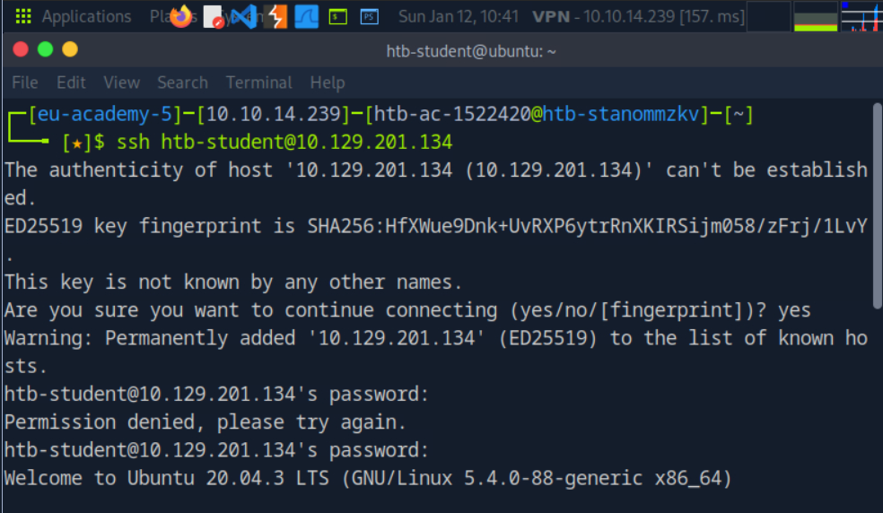
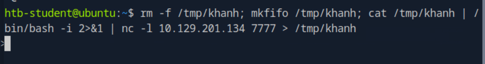
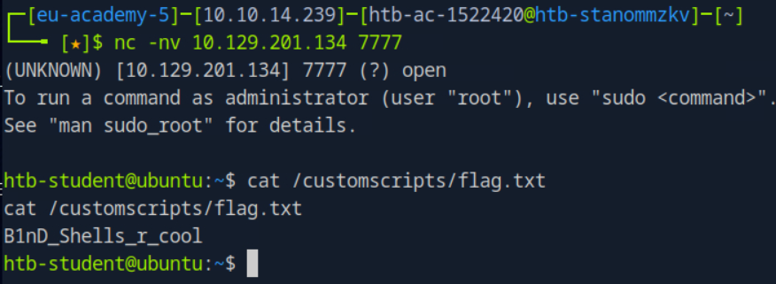

1. Des is able to issue the command nc -lvnp 443 on a Linux target. What port will she need to connect to from her attack box to successfully establish a shell session?
P/s : 443
2. SSH to the target, create a bind shell, then use netcat to connect to the target using the bind shell you set up. When you have completed the exercise, submit the contents of the flag.txt file located at /customscripts.
Ket noi ssh bang người dùng " htb-student " và mật khẩu " HTB_@cademy_stdnt! "

Trên máy chủ mục tiêu khởi tạo netcat lắng nghe cổng 7777

Máy tấn công khởi tạo kết nối tới cổng 7777 tạo thành công bind shell và đọc file flag.txt

P/s : B1nD_Shells_r_cool
