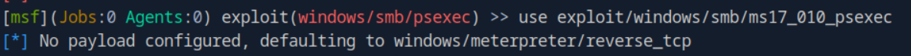
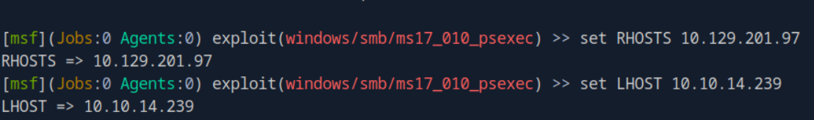
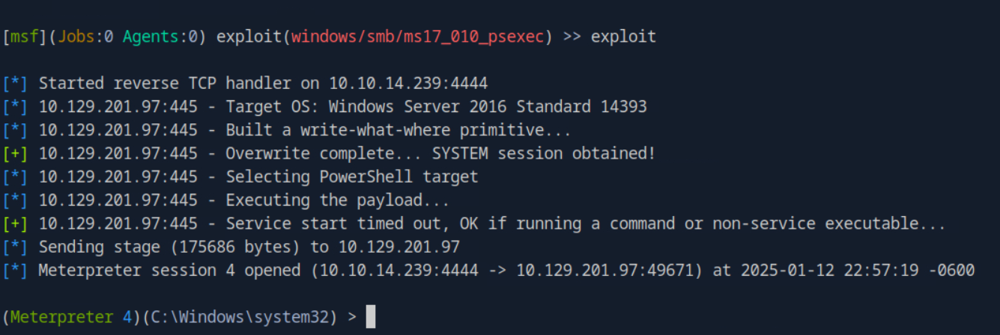
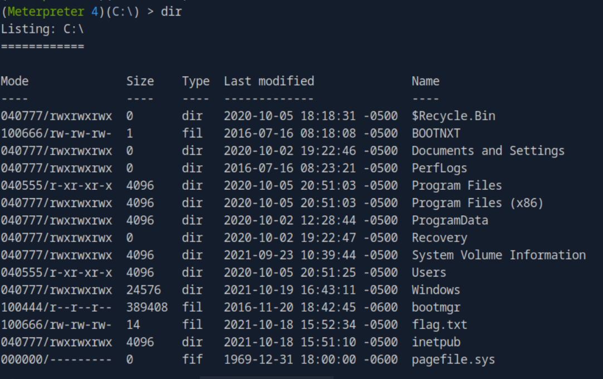
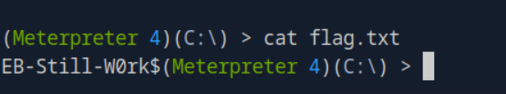

>1. What file type is a text-based DOS script used to perform tasks from the cli? (answer with the file extension, e.g. '.something')
P/s .bat
>2.  What Windows exploit was dropped as a part of the Shadow Brokers leak? (Format: ms bulletin number, e.g. MSxx-xxx)
P/s MS17-010
>3.  Gain a shell on the vulnerable target, then submit the contents of the flag.txt file that can be found in C:\
Mở msf trong command
Sử dụng payload exploit/windows/smb/ms17_010_psexec

Thiết lập các thông số cho payload

Bắt đầu khai thác

Khởi tạo shell tương tác 

Tìm được file flag

P/s:EB-Still-W0rk$