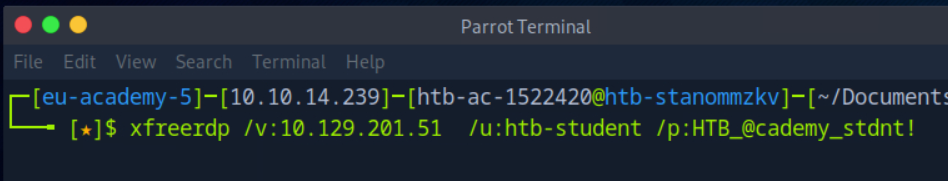
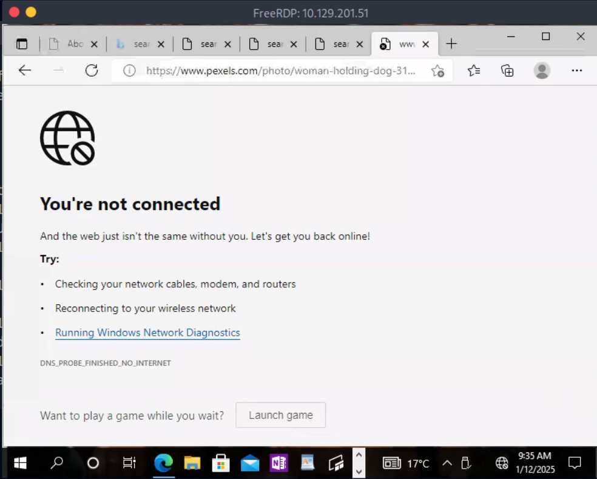
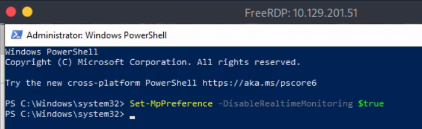
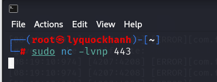
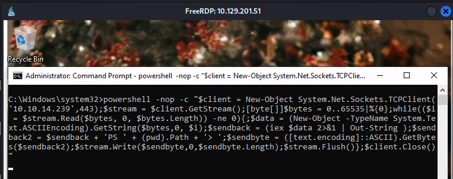
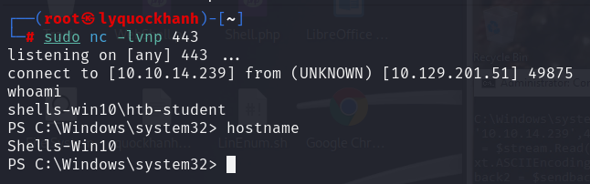

 RDP to with user "htb-student" and password "HTB_@cademy_stdnt!"
1. When establishing a reverse shell session with a target, will the target act as a client or server?
P/s : client
2. Connect to the target via RDP and establish a reverse shell session with your attack box then submit the hostname of the target box. 
Kết nối từ xa tới máy chủ mục tiêu bằng xfreerdp 

Kết nối thành công 

Vô hiệu hóa Anti virus 

Trên máy tấn công lắng nghe cổng 443

Trên máy chủ mục tiêu gửi tín hiệu về cổng 443 của máy tấn công tạo reverse shell

Tạo reverse shell thành công xem hostname

P/s:Shells-Win10

